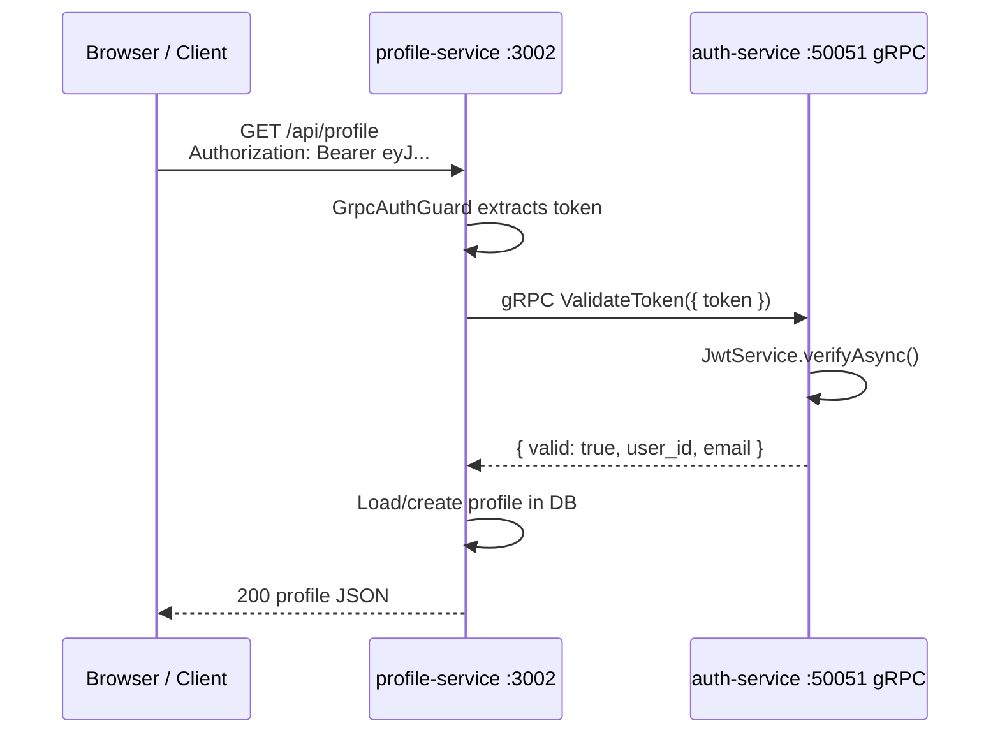
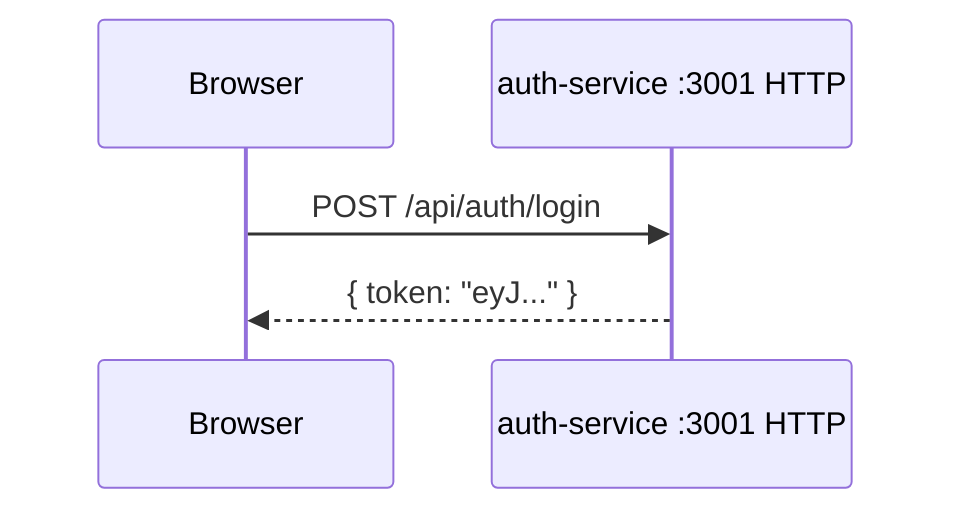

# gRPC in This Project

## What Role gRPC Plays

This project has **two separate services**:

| Service | Talks to users via | Job |
|---------|-------------------|-----|
| **auth-service** | HTTP (`/api/auth/register`, `/api/auth/login`) | Register, login, issue JWT |
| **profile-service** | HTTP (`/api/profile`) | Read/update user profiles |

When someone hits profile with `Authorization: Bearer <token>`, profile must answer: **"Is this token valid? Who is this user?"**

That check belongs to **auth** — it owns `JWT_SECRET`. Profile should not decode JWTs itself. If auth changes how tokens work, you would have to update every service that duplicated that logic.

**gRPC is the internal channel** for that question:

```
Browser  ──HTTP──►  profile-service  ──gRPC──►  auth-service
                         "validate this token"
```

- **HTTP** = public API (browser, Postman, frontend)
- **gRPC** = fast, typed, service-to-service calls on the backend

Profile never exposes token validation over HTTP. Only auth does that internally over gRPC.

---

## How It Is Implemented (4 Layers)

### 1. Contract — `auth.proto`

Shared definition of what auth exposes internally.

**File:** `libs/shared/src/proto/auth.proto`

```protobuf
service AuthService {
  rpc ValidateToken(ValidateTokenRequest) returns (ValidateTokenResponse);
}

message ValidateTokenRequest {
  string token = 1;
}

message ValidateTokenResponse {
  bool valid = 1;
  string user_id = 2;
  string email = 3;
  string error = 4;
}
```

Both services use this file so request/response shape stays in sync.

---

### 2. gRPC Server — auth-service

Auth runs **HTTP and gRPC in one process**.

#### Start the gRPC listener

**File:** `apps/auth-service/src/main.ts`

```typescript
app.connectMicroservice<MicroserviceOptions>({
  transport: Transport.GRPC,
  options: {
    package: 'auth',
    protoPath: join(process.cwd(), '../../libs/shared/src/proto/auth.proto'),
    url: `0.0.0.0:${process.env.GRPC_PORT ?? 50051}`,
  },
});

await app.startAllMicroservices();
await app.listen(process.env.PORT ?? 3001);
```

#### Handle the RPC

**File:** `apps/auth-service/src/auth.controller.ts`

```typescript
@GrpcMethod('AuthService', 'ValidateToken')
validateToken(data: { token: string }) {
  return this.authService.validateToken(data.token);
}
```

#### Business logic

**File:** `apps/auth-service/src/auth.service.ts`

Verifies the JWT and returns proto-shaped data:

```typescript
async validateToken(token: string) {
  try {
    const payload = await this.jwtService.verifyAsync(token, {
      secret: process.env.JWT_SECRET!,
    });
    return { valid: true, user_id: payload.sub, email: payload.email, error: '' };
  } catch {
    return { valid: false, user_id: '', email: '', error: 'Invalid or expired token' };
  }
}
```

Auth listens on **port 50051** for gRPC and **3001** for HTTP.

---

### 3. gRPC Client — profile-service

Profile does **not** run a gRPC server. It only **calls** auth via `AuthClient`.

**File:** `apps/profile-service/src/clients/auth.client.ts`

```typescript
@Client({
  transport: Transport.GRPC,
  options: {
    package: 'auth',
    protoPath: join(process.cwd(), '../../libs/shared/src/proto/auth.proto'),
    url: process.env.AUTH_SERVICE_GRPC_URL || 'localhost:50051',
  },
})
private client: ClientGrpc;

onModuleInit() {
  this.authService = this.client.getService<AuthGrpcService>('AuthService');
}

async validateToken(token: string) {
  const result = await this.circuitBreaker.excute(() =>
    firstValueFrom(this.authService.validateToken({ token })),
  );
  // ...
}
```

On startup, profile grabs the remote service stub. When validating a token, it calls auth over the network. The circuit breaker limits repeated calls if auth is down.

---

### 4. Guard — Ties It to HTTP Routes

**File:** `apps/profile-service/src/guards/grpc-auth.guard.ts`

`GrpcAuthGuard` runs on every profile request:

1. Read `Authorization: Bearer <token>` from the HTTP header
2. Call auth over gRPC via `AuthClient`
3. Attach `{ user_id, email }` to the request
4. Controller uses `@CurrentUser()` to get that data

---

## Full Request Flow

### Protected profile request



### Login / register (HTTP only)



Login and register never use gRPC — those are plain HTTP calls to auth.

---

## Why gRPC Instead of HTTP for This?

You could have profile call `GET http://auth-service/validate` instead. gRPC is used here because:

| Benefit | In this project |
|---------|-----------------|
| **Contract** | `.proto` file defines the API for both sides |
| **Performance** | Binary protocol, good for many internal calls |
| **Separation** | Auth logic stays in auth; profile stays thin |
| **Microservice pattern** | Each service owns its domain |

---

## Quick Reference

| Piece | Where | Role |
|-------|-------|------|
| `auth.proto` | `libs/shared` | Shared API contract |
| `connectMicroservice` + `@GrpcMethod` | auth-service | **Server** — answers "is token valid?" |
| `AuthClient` + `@Client` | profile-service | **Client** — asks auth that question |
| `GrpcAuthGuard` | profile-service | Uses client on every protected HTTP request |
| `JwtGuard` | auth-service | Protects auth's own HTTP routes (`/me`) |
| `JwtGuard` rpc bypass | auth-service | gRPC calls skip HTTP JWT check |

---

## One-Line Summary

gRPC lets profile-service delegate token validation to auth-service without sharing `JWT_SECRET` or duplicating auth logic — internal backend communication, while users still talk to both services over normal HTTP REST.

---

## Environment Variables

| Variable | Service | Purpose |
|----------|---------|---------|
| `GRPC_PORT` | auth-service | gRPC listen port (default `50051`) |
| `AUTH_SERVICE_GRPC_URL` | profile-service | Where to reach auth gRPC (e.g. `localhost:50051`) |
| `JWT_SECRET` | auth-service | Used only inside auth to sign/verify tokens |
| `PORT` | both | HTTP listen port (`3001` auth, `3002` profile) |

---

## What Profile Does **Not** Need

Profile does **not** need:

- `connectMicroservice()`
- `startAllMicroservices()`

Those are only for services that **serve** gRPC. Profile is HTTP-only and acts as a gRPC **client**.
